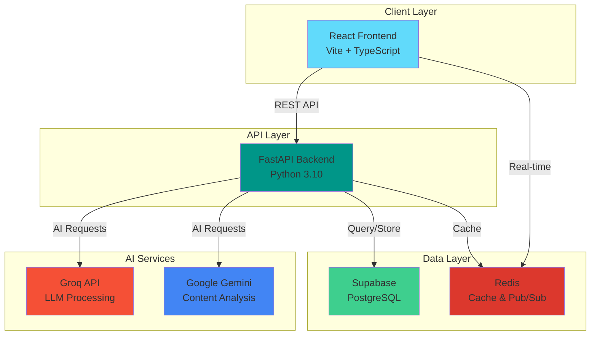
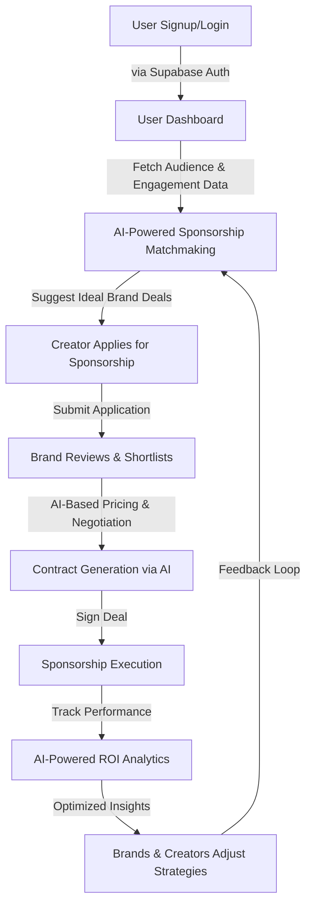
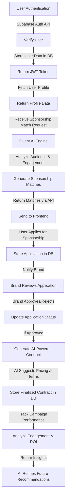

<div align="center">

# InPact AI

### AI-Powered Creator Collaboration & Sponsorship Matchmaking Platform

[](https://fastapi.tiangolo.com/)
[](https://reactjs.org/)
[](https://www.docker.com/)
[](https://supabase.com/)
[](LICENSE)

[Features](#-key-features) • [Quick Start](#-quick-start) • [Tech Stack](#-tech-stack) • [Documentation](#-documentation) • [Contributing](#-contributing)

</div>

---

## 📖 About

InPact is an open-source AI-powered platform that revolutionizes how content creators, brands, and agencies collaborate. Using advanced Generative AI, audience analytics, and engagement metrics, InPact delivers data-driven sponsorship matches that maximize value for creators while ensuring optimal ROI for brands.

### 🎯 Why InPact?

- **Smart Matching**: AI analyzes audience demographics, engagement patterns, and content style for perfect brand-creator alignment
- **Fair Pricing**: Data-driven pricing recommendations based on real engagement metrics and market trends
- **Efficient Collaboration**: Streamlined workflows from discovery to contract signing and performance tracking
- **Actionable Analytics**: Deep insights into campaign performance with AI-powered optimization suggestions

## 🚀 Quick Start

**🐳 Docker (Recommended)**: Get started in minutes - [Docker Setup Guide](DOCKER.md)

**🔧 Manual Setup**: Prefer more control? See [Manual Installation](#-manual-installation) below.

## ✨ Key Features

<table>
<tr>
<td width="50%">

### 🤖 AI-Driven Matchmaking
Automatically connects creators with brands based on:
- Audience demographics & psychographics
- Engagement rates & content style
- Historical campaign performance
- Market trends & niche alignment

</td>
<td width="50%">

### 🤝 Collaboration Hub
Facilitates creator partnerships with:
- Complementary audience discovery
- Content niche compatibility analysis
- Joint campaign opportunities
- Cross-promotion insights

</td>
</tr>
<tr>
<td width="50%">

### 💰 Smart Pricing Engine
Data-driven deal optimization:
- Fair pricing recommendations
- Market trend analysis
- Historical performance data
- Engagement-based valuations

</td>
<td width="50%">

### 📊 Performance Analytics
Comprehensive tracking & insights:
- Real-time campaign monitoring
- ROI & engagement metrics
- AI-powered optimization suggestions
- Continuous improvement feedback

</td>
</tr>
<tr>
<td width="50%">

### 📝 Contract Assistant
AI-powered negotiation support:
- Auto-generated contract templates
- Terms optimization
- Deal structure recommendations
- Legal compliance guidance

</td>
<td width="50%">

### 💬 Real-Time Messaging
Seamless communication:
- Direct creator-brand messaging
- Collaboration discussions
- File sharing & attachments
- Notification system

</td>
</tr>
</table>

## 🛠️ Tech Stack

<div align="center">

| Layer | Technology |
|-------|-----------|
| **Frontend** | React 18 + TypeScript + Vite |
| **UI Framework** | Tailwind CSS + shadcn/ui |
| **Backend** | FastAPI (Python 3.10+) |
| **Database** | Supabase (PostgreSQL) |
| **Caching** | Redis 7 |
| **AI/ML** | Groq API + Google Gemini |
| **Auth** | Supabase Auth |
| **DevOps** | Docker + Docker Compose |

</div>

</div>

## 📋 Architecture Overview



## 🔄 How It Works

### User Journey

**1. Registration & Profile Setup**
- Creators, brands, and agencies sign up and set up their profiles.
- AI gathers audience insights and engagement data.

**2. AI-Powered Sponsorship Matchmaking**
- The platform suggests brands and sponsorship deals based on audience metrics.
- Creators can apply for sponsorships or receive brand invitations.

**3. Collaboration Hub**
- Creators can find and connect with others for joint campaigns.
- AI recommends potential collaborations based on niche and audience overlap.

**4. AI-Based Pricing & Contract Optimization**
- AI provides fair pricing recommendations for sponsorships.
- Auto-generates contract templates with optimized terms.

**5. Campaign Execution & Tracking**
- Creators execute sponsorship campaigns.
- Brands track campaign performance through engagement and ROI metrics.

**6. Performance Analysis & Continuous Optimization**
- AI analyzes campaign success and suggests improvements for future deals.
- Brands and creators receive insights for optimizing future sponsorships.

---

## 🚀 Getting Started

### Prerequisites

**Option A: Docker (Recommended) ⚡**
- [Docker Desktop](https://www.docker.com/products/docker-desktop/) installed
- [Supabase](https://supabase.com/) account (free tier available)

**Option B: Manual Setup 🔧**
- [Node.js](https://nodejs.org/) 18+ & npm
- [Python](https://www.python.org/) 3.10+ & pip
- [Supabase](https://supabase.com/) account

### 🐳 Quick Start with Docker

**1. Clone the Repository**

```sh
git clone https://github.com/AOSSIE-Org/InPact.git
cd InPact
```

**2. Configure Environment Variables**

**Backend:**
```sh
cd Backend
cp .env.example .env
# Edit Backend/.env with your Supabase and API credentials
```

**Frontend:**
```sh
cd ../Frontend
cp .env.example .env
# Edit Frontend/.env with your Supabase credentials
```

**3. Launch All Services**

From the project root:
```sh
docker compose up --build
```

**Services Available:**
- 🌐 Frontend: http://localhost:5173
- ⚡ Backend API: http://localhost:8000
- 📚 API Docs: http://localhost:8000/docs
- 🔴 Redis: localhost:6379

**4. Stop Services**

```sh
docker compose down
# Remove volumes: docker compose down -v
```

> 📖 For detailed Docker setup, troubleshooting, and production deployment, see [DOCKER.md](DOCKER.md)

---

### 🔧 Manual Installation

**1. Clone the Repository**

```sh
git clone https://github.com/AOSSIE-Org/InPact.git
cd InPact
```

**2. Frontend Setup**

```sh
cd Frontend
npm install
cp .env.example .env
```

Configure `Frontend/.env` with your [Supabase credentials](https://supabase.com/):
- `VITE_SUPABASE_URL`: Your project URL
- `VITE_SUPABASE_ANON_KEY`: Your anon/public key

**3. Backend Setup**

```sh
cd ../Backend
pip install -r requirements.txt
cp .env.example .env
```

Configure `Backend/.env`:
- **Supabase**: Database connection string (PostgreSQL)
- **Groq API**: Get key from [Groq Console](https://console.groq.com/)
- **Gemini API**: Get key from [Google AI Studio](https://makersuite.google.com/)

**4. Start Development Servers**

Terminal 1 (Frontend):
```sh
cd Frontend
npm run dev
```

Terminal 2 (Backend):
```sh
cd Backend
uvicorn app.main:app --reload
```

**Access the Application:**
- Frontend: http://localhost:5173
- Backend API: http://localhost:8000
- API Documentation: http://localhost:8000/docs

---

## 📊 Data Population

To populate your database with sample data:

1. Open your [Supabase Dashboard](https://supabase.com/)
2. Navigate to **SQL Editor** in the left sidebar
3. Copy the SQL queries from `Backend/sql.txt`
4. Paste into the SQL Editor and click **Run**

This creates the required tables and seeds initial data for testing. 🚀

---

## 📖 Documentation

- [🐳 Docker Setup Guide](DOCKER.md) - Complete containerization guide
- [🚀 Getting Started](GETTING-STARTED.md) - Detailed setup instructions
- [🏗️ Architecture](DOCKER-ARCHITECTURE.md) - System architecture overview
- [📚 API Documentation](http://localhost:8000/docs) - Interactive API docs (when backend is running)

---

## 🤝 Contributing

We welcome contributions from the community! Here's how you can help:

### Quick Start
1. **Fork** the repository
2. **Clone** your fork: `git clone https://github.com/YOUR-USERNAME/InPact.git`
3. **Create a branch**: `git checkout -b feature/amazing-feature`
4. **Make your changes** and commit: `git commit -m "Add amazing feature"`
5. **Push** to your fork: `git push origin feature/amazing-feature`
6. **Open a Pull Request**

### Development Guidelines
- Follow existing code style and conventions
- Write clear commit messages
- Add tests for new features
- Update documentation as needed
- Ensure all tests pass before submitting PR

### Report Issues
Found a bug or have a feature request? [Open an issue](https://github.com/AOSSIE-Org/InPact/issues)

---

## 📊 Detailed Workflow Diagrams

### Overall System Workflow



### Frontend Workflow


### Backend Workflow



---

## 📞 Support & Community

- **Issues**: [GitHub Issues](https://github.com/AOSSIE-Org/InPact/issues)
- **Discussions**: [GitHub Discussions](https://github.com/AOSSIE-Org/InPact/discussions)
- **Discord**: Join our community server for real-time help

---

## 📄 License

This project is licensed under the AGPL License - see the [LICENSE](LICENSE) file for details.

---

<div align="center">

**Built with ❤️ by the AOSSIE Community**

⭐ Star us on GitHub — it motivates us a lot!

[Report Bug](https://github.com/AOSSIE-Org/InPact/issues) • [Request Feature](https://github.com/AOSSIE-Org/InPact/issues) • [Contribute](CONTRIBUTING.md)

</div>

