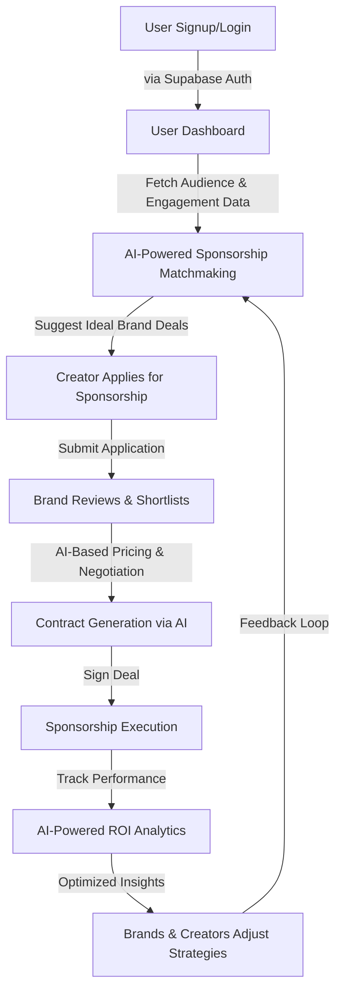
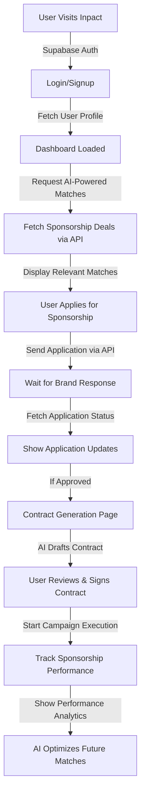
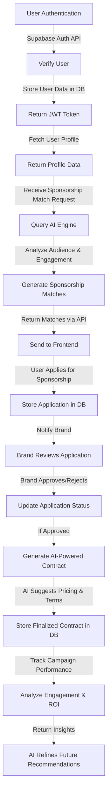

# Inpact - AI-Powered Creator Collaboration & Sponsorship Matchmaking

Inpact is an open-source AI-powered platform designed to connect content creators, brands, and agencies through data-driven insights. By leveraging Generative AI (GenAI), audience analytics, and engagement metrics, Inpact ensures highly relevant sponsorship opportunities for creators while maximizing ROI for brands investing in influencer marketing.

## Features

### AI-Driven Sponsorship Matchmaking

- Automatically connects creators with brands based on audience demographics, engagement rates, and content style.

### AI-Powered Creator Collaboration Hub

- Facilitates partnerships between creators with complementary audiences and content niches.

### AI-Based Pricing & Deal Optimization

- Provides fair sponsorship pricing recommendations based on engagement, market trends, and historical data.

### AI-Powered Negotiation & Contract Assistant

- Assists in structuring deals, generating contracts, and optimizing terms using AI insights.

### Performance Analytics & ROI Tracking

- Enables brands and creators to track sponsorship performance, audience engagement, and campaign success.

## Tech Stack

- **Frontend**: ReactJS
- **Backend**: FastAPI
- **Database**: Supabase
- **AI Integration**: GenAI for audience analysis and sponsorship recommendations

---

## Workflow

### 1. User Registration & Profile Setup

- Creators, brands, and agencies sign up and set up their profiles.
- AI gathers audience insights and engagement data.

### 2. AI-Powered Sponsorship Matchmaking

- The platform suggests brands and sponsorship deals based on audience metrics.
- Creators can apply for sponsorships or receive brand invitations.

### 3. Collaboration Hub

- Creators can find and connect with others for joint campaigns.
- AI recommends potential collaborations based on niche and audience overlap.

### 4. AI-Based Pricing & Contract Optimization

- AI provides fair pricing recommendations for sponsorships.
- Auto-generates contract templates with optimized terms.

### 5. Campaign Execution & Tracking

- Creators execute sponsorship campaigns.
- Brands track campaign performance through engagement and ROI metrics.

### 6. Performance Analysis & Continuous Optimization

- AI analyzes campaign success and suggests improvements for future deals.
- Brands and creators receive insights for optimizing future sponsorships.

---

## Getting Started

### Prerequisites

Make sure you have these installed:
- Node.js (v18 or higher) + npm
- Python 3.9+ 
- Git
- A Supabase account (free tier is enough)

### Local Development Setup (Step-by-Step)

#### 1. Clone the Repository
```bash
git clone https://github.com/AOSSIE-Org/InPact.git
cd InPact
```

#### 2. Frontend Setup

```bash
cd frontend
npm install
```

Create a `.env` file in the `frontend/` folder:
```env
VITE_SUPABASE_URL=https://your-project.supabase.co
VITE_SUPABASE_ANON_KEY=your-anon-public-key
VITE_YOUTUBE_API_KEY=your-youtube-api-key
```

**How to get Supabase frontend keys:**
1. Go to [https://app.supabase.com](https://app.supabase.com)
2. Open your project → **Settings** → **API**
3. Copy **Project URL** → `VITE_SUPABASE_URL`
4. Copy **anon public** key → `VITE_SUPABASE_ANON_KEY`

**How to get Youtube API Key**
1. Log in to the [https://console.cloud.google.com/](https://console.cloud.google.com/)
2. Create a new project or select an existing one from the project drop-down menu.
3. In the Cloud Console, search for "YouTube Data API" in the search bar and select "YouTube Data API v3" from the results.
4. Click the "Enable" button to enable the API for your project.
5. Navigate to the "Credentials" tab in the left-hand menu.
6. Click "Create Credentials" and then select "API key" from the dropdown menu and now use that api key.

#### 3. Backend Setup (with Python Virtual Environment – Highly Recommended)

```bash
cd ../backend

# Create a virtual environment (isolates dependencies)
python -m venv venv

# Activate it
# Windows:
venv\Scripts\activate
# macOS / Linux:
source venv/bin/activate

# Install backend dependencies
pip install -r requirements.txt

cd app
```

#### 4. Create Backend `.env` File

Create `.env` in `backend/app/` and fill all values:

```env
# Supabase Database Connection
user=postgres
password=YOUR_DB_PASSWORD
host=db.yourproject.supabase.co
port=5432
dbname=postgres

# API Keys
GROQ_API_KEY=your_groq_key
SUPABASE_URL=https://your-project.supabase.co
SUPABASE_KEY=your-anon-public-key
GEMINI_API_KEY=your_gemini_key
YOUTUBE_API_KEY=your_youtube_key
```

**Where to get each key (with direct links):**

| Variable            | Service                        | How to Get (Step-by-Step)                                                                                   |
|---------------------|--------------------------------|-------------------------------------------------------------------------------------------------------------|
| `SUPABASE_URL` & `SUPABASE_KEY` | Supabase                  | Same as frontend → **Settings → API** → copy URL & anon key                                                |
| `host` & `password` | Supabase PostgreSQL           | **Settings → Database → Connection info** → copy Host + the password you set when creating the project    |
| `GROQ_API_KEY`      | Groq (fast AI inference)      | → [console.groq.com/keys](https://console.groq.com/keys) → Create API Key → copy (`gsk_...`)                |
| `GEMINI_API_KEY`    | Google Gemini                 | → [aistudio.google.com/app/apikey](https://aistudio.google.com/app/apikey) → Create API key                |
| `YOUTUBE_API_KEY`   | YouTube Data API v3           | 1. [console.cloud.google.com](https://console.cloud.google.com)<br>2. New Project → Enable YouTube Data API v3<br>3. Credentials → Create API Key |

All are free for development use.

#### 5. Start the Servers

**Terminal 1 (Frontend):**
```bash
cd frontend
npm run dev
```
→ Opens at `http://localhost:5173`

**Terminal 2 (Backend – make sure venv is active):**
```bash
cd backend/app
uvicorn main:app --reload
```
→ Runs at `http://127.0.0.1:8000`

You’re all set! Open `http://localhost:5173` and register/login.

---

## Data Population

To populate the database with initial data, follow these steps:

1. **Open Supabase Dashboard**

   - Go to [Supabase](https://supabase.com/) and log in.
   - Select your created project.

2. **Access the SQL Editor**

   - In the left sidebar, click on **SQL Editor**.

3. **Run the SQL Script**
   - Open the `sql.txt` file in your project.
   - Copy the SQL queries from the file.
   - Paste the queries into the SQL Editor and click **Run**.

This will populate the database with the required initial data for the platform. 🚀

---

## Contributing

We welcome contributions from the community! To contribute:

1. Fork the repository.
2. Create a new branch for your feature (`git checkout -b feature-name`).
3. Commit your changes (`git commit -m "Added feature"`).
4. Push to your branch (`git push origin feature-name`).
5. Open a Pull Request.

---

## Overall Workflow



**FRONTEND workflow in detail**



**BACKEND workflow in detail**



## Contact

For queries, issues, or feature requests, please raise an issue or reach out on our Discord server.


Happy Coding!

